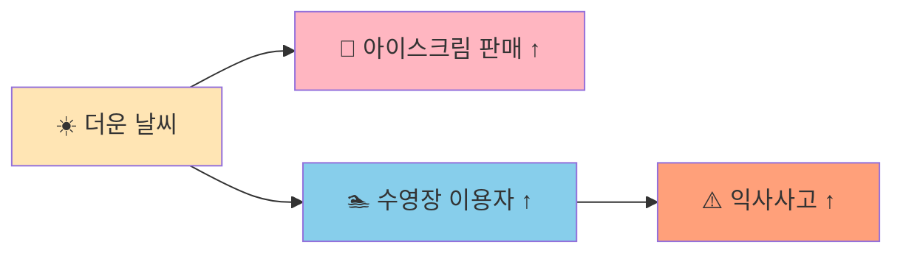
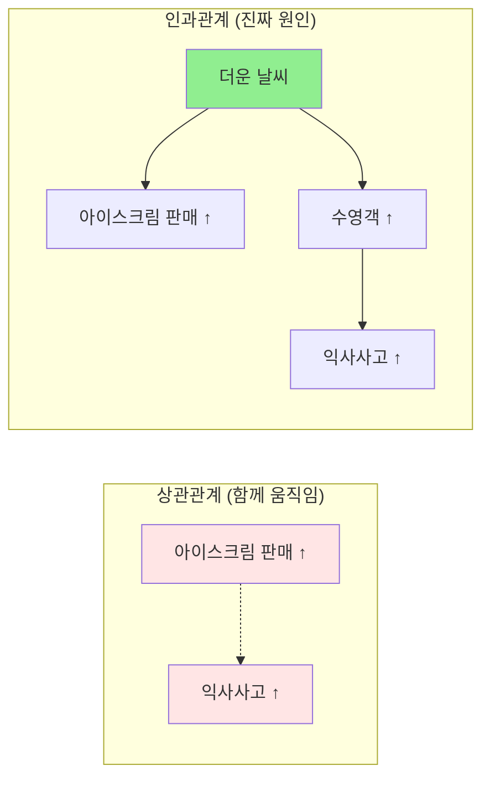
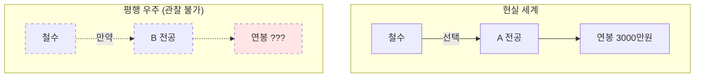
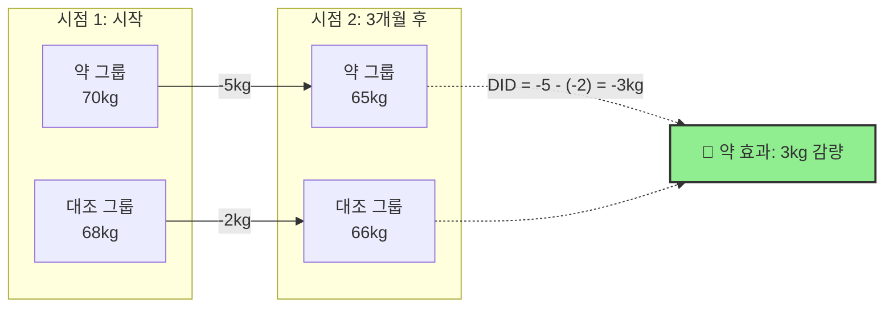
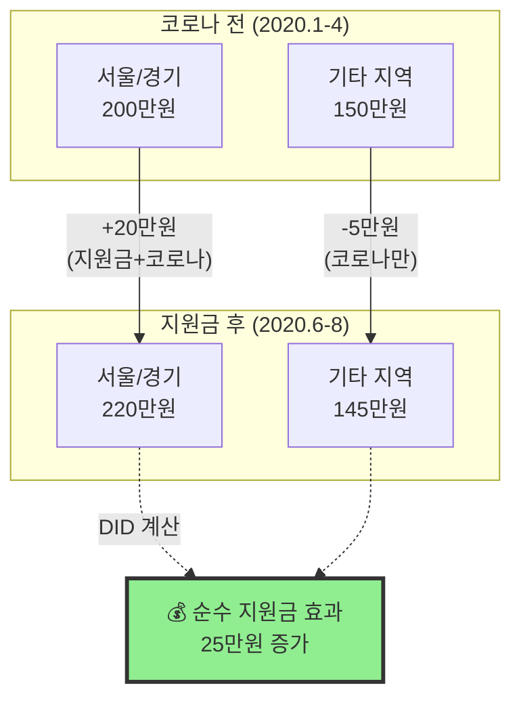
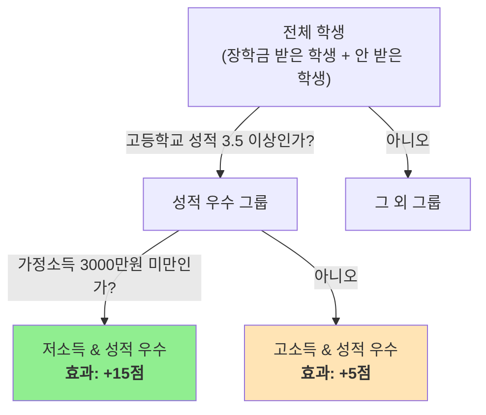
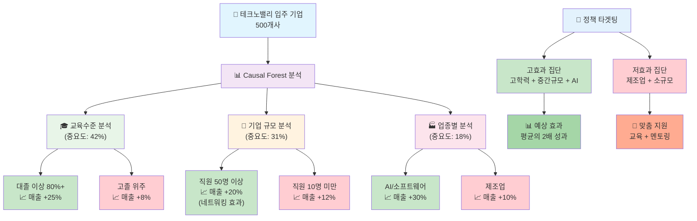
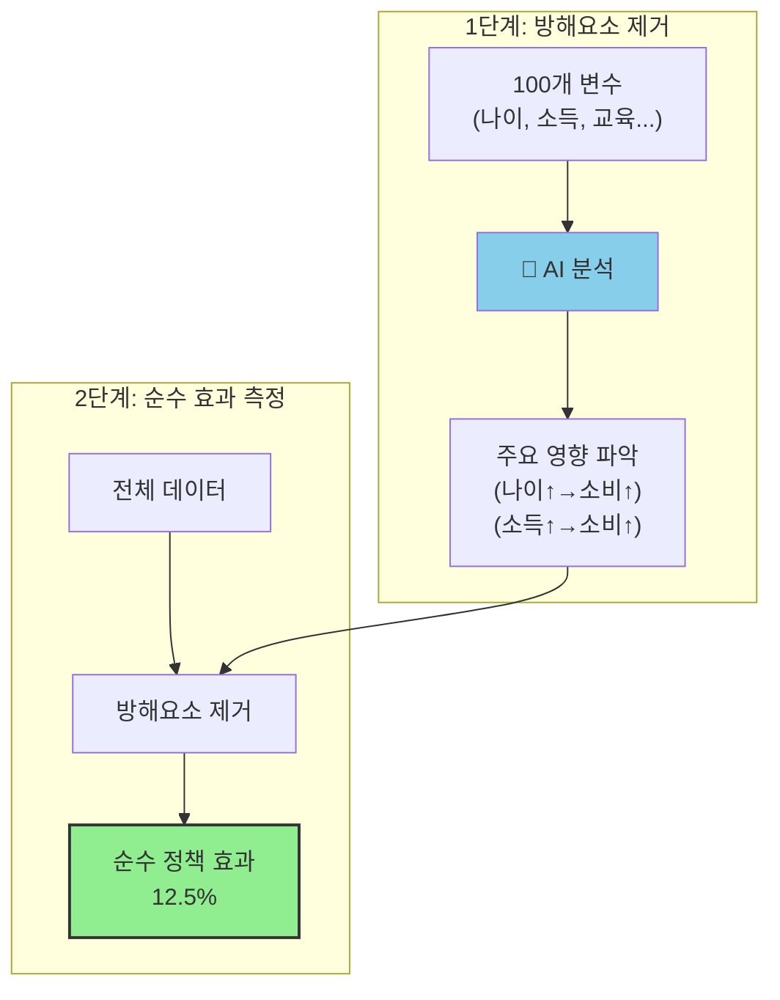
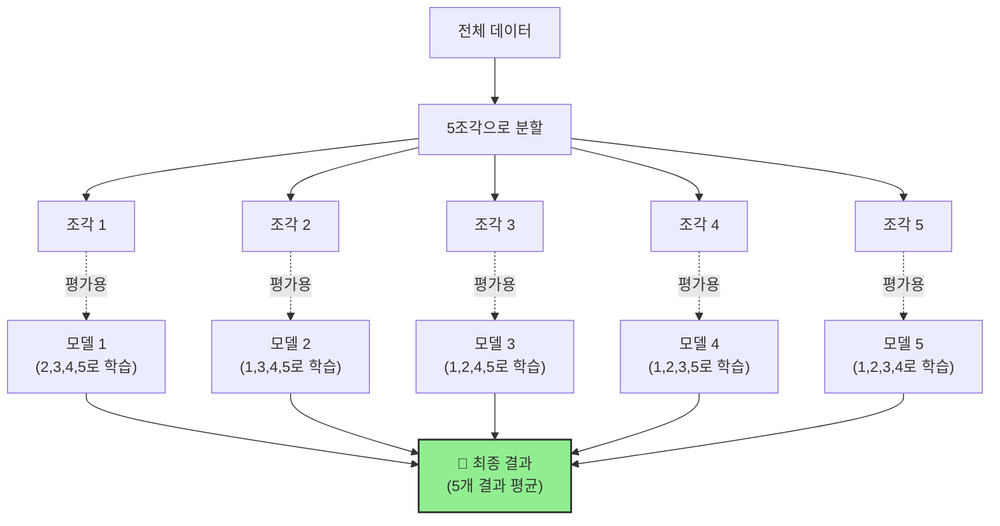

# 2장. 원인과 결과 찾기 - 정책분석을 위한 쉬운 인과추론 🎯

**🎯 학습 목표: 정책이 정말 효과가 있는지 어떻게 확인하는지 배우고, AI의 도움으로 더 정확하게 측정하는 방법 이해하기**

---

## 🌟 이 장에서 배울 내용 미리보기

- **진짜 원인 찾기**: 아이스크림과 익사사고가 같이 늘어나는 이유는?
- **공정한 비교하기**: 비슷한 사람끼리 비교해서 정책 효과 정확히 측정
- **전후 비교하기**: 코로나 전후 소비패턴으로 재난지원금 효과 분석
- **개인별 맞춤**: 누구에게 정책이 더 효과적인지 찾아내기
- **AI 도움**: 복잡한 분석을 자동으로 정확하게 처리

---

## 2.1 인과추론이 무엇인가요? 🤔

### 2.1.1 "진짜 원인 찾기" - 탐정처럼 생각하기

**쉬운 설명**: 어떤 일이 일어난 진짜 이유를 찾아내는 방법

🔍 **실생활 비유**: 
- **상황**: 범죄 현장에서 탐정이 진범을 찾는 과정
- **문제**: 여러 용의자가 있지만 누가 진짜 범인인가?
- **해결**: 증거를 체계적으로 모으고 분석해서 진범 찾기

**인과추론이 필요한 이유**

**1️⃣ 착각하기 쉬운 상관관계**
- **🍦 아이스크림 vs 익사사고 예시**
  - **관찰**: 아이스크림 판매량이 늘면 익사사고도 늘어남
  - **잘못된 결론**: "아이스크림이 익사를 일으킨다"
  - **진짜 원인**: 더운 날씨 → 아이스크림 많이 팔림 + 수영하는 사람 많아짐

- **📊 그래프로 이해하기**



```
여름철 데이터:
온도 ↑ → 아이스크림 판매 ↑
온도 ↑ → 수영장/바다 이용자 ↑ → 익사사고 ↑

결론: 온도가 진짜 원인, 아이스크림은 무관
```

**2️⃣ 정책에서 자주 일어나는 실수**
- **교육정책 예시**
  - **관찰**: 사교육비가 많은 지역일수록 대학진학률이 높음
  - **잘못된 결론**: "사교육비를 늘리면 대학진학률이 높아진다"
  - **진짜 원인**: 부모 소득이 높음 → 사교육비 많이 씀 + 좋은 환경 제공

💡 **핵심 요약**



```
🚫 상관관계 ≠ ✅ 인과관계

상관관계: 둘이 함께 움직이는 것 (단순한 관찰)
• "아이스크림 판매 ↑ = 익사사고 ↑" (함께 증가)

인과관계: 하나가 다른 하나를 진짜로 변화시키는 것 (진실)
• "더운 날씨 → 아이스크림 판매 ↑ + 수영객 ↑ → 익사사고 ↑"

🎯 목표: 정책의 진짜 효과만 정확히 측정하기
```

### 2.1.2 "만약에 게임" - Potential Outcomes 이해하기

**쉬운 설명**: "만약 내가 다른 선택을 했다면?" 하는 상상을 과학적으로 하는 방법

🎬 **영화 비유**: 
- **평행우주 영화**: 같은 사람이 다른 선택을 하는 여러 세계
- **현실의 한계**: 우리는 한 번에 하나의 세계만 볼 수 있음
- **인과추론**: 보지 못한 다른 세계를 똑똑하게 추측하기

**만약에 게임의 원리**

**🎓 대학 선택 예시**
- **현실**: 철수는 A 전공 선택 → 졸업 후 연봉 3000만원
- **궁금한 점**: "만약 철수가 B 전공을 선택했다면?"
- **문제점**: 타임머신이 없어서 확인 불가능
- **해결책**: 철수와 비슷한 다른 사람들의 데이터로 추측



**👥 비슷한 사람 찾기**
```
철수와 비슷한 사람들:
• 나이, 성별, 고등학교 성적 유사
• 가정환경, 거주지역 비슷
• A 전공 간 사람들 vs B 전공 간 사람들 비교
→ 전공의 진짜 효과 추정
```

**🏥 의료 정책 예시**
- **상황**: 새로운 치료법의 효과 측정
- **개인별 질문**: "이 환자가 치료받으면 / 안 받으면?"
- **현실**: 한 환자는 둘 중 하나만 경험 가능
- **해결**: 비슷한 환자들을 두 그룹으로 나누어 비교

💡 **핵심 요약**
```
🎭 Potential Outcomes (잠재 결과):
• 같은 사람이 다른 상황에서 보일 수 있는 결과들
• 현실의 한계: 하나만 관찰 가능 (근본적 문제)
• 똑똑한 해결: 비슷한 다른 사람들로 "만약에"를 추론
• 목표: 타임머신 없이도 정확한 인과관계 파악
```

### 2.1.3 좋은 비교 vs 나쁜 비교

**좋은 비교의 조건**

**1️⃣ 비슷한 조건에서 비교**
- **🏃‍♂️ 운동 효과 비교 예시**
  - **좋은 비교**: 나이, 성별, 기초체력이 비슷한 사람들끼리
  - **나쁜 비교**: 20대 운동선수 vs 60대 일반인

**2️⃣ 다른 요인들 통제**
- **📚 교육 정책 효과 비교**
  - **좋은 비교**: 경제수준, 부모 교육수준 등이 비슷한 학생들
  - **나쁜 비교**: 강남 학생 vs 농촌 학생 (다른 요인이 너무 많음)

**3️⃣ 충분한 수의 사례**
- **원리**: 우연히 일어난 일과 진짜 효과 구분
- **방법**: 많은 사람들을 관찰해서 패턴 확인

🌟 **실생활 적용**
```
정책 평가할 때 확인사항:
✅ 정책 받은 그룹 vs 안 받은 그룹이 원래 비슷했나?
✅ 정책 외에 다른 차이점은 없나?
✅ 충분히 많은 사례를 봤나?
✅ 우연이 아닌 진짜 효과인가?
```

---

## 2.2 비교하고 분석하는 방법들 ⚖️

### 2.2.1 "직선 그어서 관계 찾기" - 회귀분석의 쉬운 이해

**쉬운 설명**: 점들 사이에 가장 잘 맞는 직선을 그어서 관계를 찾는 방법

📈 **그래프 그리기 비유**: 
- **상황**: 시험 공부시간과 점수의 관계를 알고 싶음
- **방법**: 그래프에 점들 찍고 → 가장 잘 맞는 직선 그리기
- **결과**: "공부시간 1시간 늘면 점수가 평균 5점 올라간다"

**회귀분석이 하는 일**

**1️⃣ 관계의 크기 측정**
```
예시: 교육 투자와 성과
• X축: 학급당 교육예산 (만원)
• Y축: 학생 평균 성적
• 직선의 기울기: 100만원 늘면 성적 2점 상승
```

**2️⃣ 다른 요인들 고려**
- **단순 비교**: 교육예산만 보기
- **정교한 분석**: 지역, 부모소득, 학교규모 등도 함께 고려
- **장점**: 교육예산의 순수한 효과만 분리해서 측정

**3️⃣ 예측과 시뮬레이션**
- **질문**: "예산을 20% 늘리면 성적이 얼마나 오를까?"
- **답**: 회귀분석 결과로 예측 가능

**⚠️ 회귀분석의 한계**
- **직선 가정**: 실제로는 곡선일 수 있음
- **숨겨진 요인**: 측정하지 못한 중요 요인 존재 가능
- **인과관계 주의**: 상관관계는 찾지만 인과관계는 별도 검증 필요

### 2.2.2 "쌍둥이 찾기 게임" - 성향점수 매칭(PSM)

**쉬운 설명**: 정책을 받은 사람과 최대한 비슷한 "가짜 쌍둥이"를 찾아서 비교하는 방법

💕 **소개팅 앱 비유**: 
- **매칭 앱**: 나이, 취미, 성격이 비슷한 사람들끼리 연결
- **PSM**: 나이, 소득, 교육수준이 비슷한 사람들끼리 연결해서 정책 효과 비교

**성향점수 매칭의 과정**

**1️⃣ 비슷함 점수 계산**
```
정책 참여 확률 계산:
김철수(25세, 대졸, 연봉 3000만원) → 참여확률 0.7
이영희(26세, 대졸, 연봉 2900만원) → 참여확률 0.69
→ 둘은 매우 비슷한 "쌍둥이"
```

**2️⃣ 쌍둥이끼리 매칭**
- **그룹 A**: 정책에 참여한 사람들
- **그룹 B**: 참여하지 않은 사람들
- **매칭**: A의 각 사람마다 가장 비슷한 B의 사람 찾기

**3️⃣ 공정한 비교**
- **매칭 전**: 두 그룹이 원래 달랐을 수 있음 (불공정 비교)
- **매칭 후**: 두 그룹이 거의 동일함 (공정한 비교)
- **결과**: 정책의 순수한 효과만 측정

**🎯 한국 기초연금 정책 사례**

**정책 내용**: 65세 이상 어르신 중 소득 하위 70%에게 월 30만원 지급

**분석 과정**:
1. **대상 확인**: 기초연금 받는 어르신 vs 안 받는 어르신
2. **쌍둥이 찾기**: 나이, 건강상태, 거주지역이 비슷한 분들끼리 매칭
3. **효과 측정**: 생활만족도, 의료비 지출, 소비패턴 비교

**📊 분석 결과 (예시)**
```
💔 매칭 전 (불공정한 비교):
• 기초연금 그룹: 평균 나이 72세, 건강상태 보통
• 비교 그룹: 평균 나이 68세, 건강상태 좋음
→ 나이와 건강상태가 달라서 비교 의미 없음

💝 매칭 후 (공정한 비교):
• 두 그룹 모두: 평균 나이 71세, 건강상태 보통
→ 이제 진짜 기초연금 효과만 비교 가능!

🎯 최종 결과: 기초연금이 월 소비를 평균 11.5만원 증가시킴
```

**✅ 매칭 성공 확인법**
- **균형 검정**: 매칭 후 두 그룹의 특성이 비슷해졌는지 확인
- **매칭률**: 얼마나 많은 사람들이 좋은 쌍둥이를 찾았는지
- **표준화 평균차이**: 0.1 이하면 잘 매칭됨

💡 **핵심 요약**
```
성향점수 매칭(PSM):
• 목표: 정책 받은 사람과 비슷한 "가짜 쌍둥이" 찾기
• 방법: 여러 특성을 종합해서 비슷함 점수 계산
• 장점: 직관적이고 이해하기 쉬움
• 주의점: 측정하지 못한 특성은 고려 불가
```

🌟 **실생활 적용**
```
PSM이 유용한 정책들:
🎓 교육 정책: 학생 배경이 다양할 때
🏥 의료 정책: 환자 상태가 다양할 때  
💼 고용 정책: 구직자 조건이 다양할 때
🏠 복지 정책: 수혜 대상이 선별적일 때
```

---

## 2.3 전후 비교하기 - 이중차분법(DID) 📊

### 2.3.1 "다이어트 약 효과 테스트" - DID의 기본 원리

**쉬운 설명**: 정책 전후와 그룹 간 차이를 동시에 비교해서 정책의 순수한 효과만 찾아내는 방법

🏃‍♀️ **다이어트 약 비유**: 
- **문제**: 다이어트 약의 진짜 효과를 어떻게 측정할까?
- **단순 비교의 한계**: 계절, 운동량, 식습관 변화 등 다른 요인들
- **DID 해결책**: (약먹은그룹 변화) - (안먹은그룹 변화) = 약의 순수 효과

**이중차분법의 논리**

**1️⃣ 첫 번째 차분: 시간에 따른 변화**
```
예시: 체중 변화
• 약먹은 그룹: 3개월 후 -5kg
• 안먹은 그룹: 3개월 후 -2kg
→ 단순히 보면 약 효과가 3kg인 것 같음
```

**2️⃣ 두 번째 차분: 그룹 간 원래 차이 제거**
```
하지만 원래부터 차이가 있었다면?
• 약먹은 그룹: 원래 다이어트 의지가 강했음
• 안먹은 그룹: 원래 다이어트에 관심 없었음
→ 이 차이를 빼야 약의 순수 효과
```

**3️⃣ 이중차분 = 진짜 효과**



```
DID = (약그룹 변화) - (대조그룹 변화)
    = (-5kg) - (-2kg) = -3kg
→ 다이어트 약의 순수 효과는 3kg 감량
```

### 2.3.2 🦠 COVID-19 재난지원금 효과 분석 실제 사례

**정책 배경**: 2020년 COVID-19으로 전 국민에게 긴급재난지원금 지급

**분석 설계**:
- **처치 그룹**: 재난지원금을 빨리 받은 지역 (서울, 경기)
- **대조 그룹**: 늦게 받은 지역 (기타 지방)
- **측정 변수**: 월별 소비지출 변화

**📈 그래프로 이해하는 DID**



```
코로나 전 (2020년 1-4월):
서울/경기: 월 평균 소비 200만원
기타 지역: 월 평균 소비 150만원
→ 원래 50만원 차이

지원금 지급 후 (2020년 6-8월):
서울/경기: 월 평균 소비 220만원 (+20만원)
기타 지역: 월 평균 소비 145만원 (-5만원)

DID 계산:
재난지원금 효과 = (+20) - (-5) = 25만원
```

**🔍 결과 해석**

🚨 **단순 비교의 오류**:
- 서울/경기가 20만원 증가 → "재난지원금 효과는 20만원?"
- 하지만 이것은 **코로나 영향을 무시한 결론**!

✅ **DID의 정확한 분석**:
- 재난지원금의 **순수한 효과는 25만원** 증가
- 복잡하게 계산?
  - 서울/경기: +20만원 (지원금 + 코로나 영향)
  - 기타 지역: -5만원 (코로나만 영향)
  - **순수 지원금 효과 = 20 - (-5) = 25만원**

✅ **평행 추세 가정 확인** (가장 중요!)


*위 그래프는 DID 분석의 핵심인 평행 추세 가정을 시각적으로 보여줍니다. 정책 개입 전(2019.1~2019.12) 두 그룹의 소비 패턴이 평행하게 움직이는 것을 확인할 수 있으며, 재난지원금 지급 후 나타난 차이가 정책의 순수한 효과임을 알 수 있습니다.*

```
DID의 전제 조건:
📏 "재난지원금이 없었다면, 두 지역의 소비 패턴이 비슷하게 변했을 것"

🔍 확인 방법:
1. 코로나19 전 데이터 수집 (2019.1 ~ 2020.3)
2. 두 지역의 월별 소비 그래프 그리기
3. 선이 평행하면 ✅, 기울어지면 ❌

🎯 결과: 코로나19 전 15개월간 소비 패턴이 거의 평행 → 가정 성립!
```

### 2.3.3 DID의 장점과 주의점

**💪 DID의 강력한 장점들**
1. **시간불변 특성 제거**: 지역별 고유한 특성(문화, 인프라 등) 자동 제거
2. **전체적 변화 제거**: 경기변동, 계절효과 등 모든 지역에 공통된 영향 제거
3. **직관적 이해**: 그래프로 쉽게 설명 가능

**⚠️ 주의해야 할 점듡**
1. **평행 추세 가정**: 
   - 가정: "정책 없었다면 두 그룹이 비슷하게 변했을 것"
   - 확인법: 정책 전 몇 년간 추세가 평행했는지 그래프로 검증
2. **동시 정책 주의**: 
   - 문제: 같은 시기 다른 정책 시행 시 효과가 섞임
   - 해결: 다른 정책 영향을 별도로 분석하고 제외
3. **구성 변화**: 
   - 문제: 그룹 내 구성원이 바뀌면 분석 결과 왜곡
   - 예시: 인구 이동, 기업 신설/폐업 등

💡 **핵심 요약**
```
이중차분법(DID):
• 원리: (처치군 변화) - (대조군 변화) = 순수 효과
• 장점: 시간에 따른 변화와 그룹 간 차이 동시 고려
• 핵심 가정: 평행 추세 (정책 없이도 비슷하게 변했을 것)
• 활용: 특정 시점에 특정 집단만 받은 정책 평가
```

---

## 2.4 개인별 맞춤 효과 찾기 - 인과나무(Causal Forest) 🌳

### 2.4.1 "20가지 질문 게임" - 의사결정 나무의 원리

**쉬운 설명**: 질문을 차례차례 해서 누구에게 정책이 더 효과적인지 찾아내는 방법

🏥 **의사 진단 비유**: 
- **상황**: 환자가 병원에 와서 "배가 아파요"
- **의사의 질문**: "열이 나나요?" → "언제부터 아팠나요?" → "어디가 아픈가요?"
- **결과**: 질문 답변에 따라 각각 다른 치료법 처방

**인과나무가 하는 질문들**

**🎓 교육정책 예시: "누구에게 장학금이 더 효과적일까?"**

인과나무는 정책의 효과가 모든 사람에게 동일하지 않다는 전제에서 출발합니다. **'장학금을 받은 학생들(실험집단)'**과 **'받지 않은 학생들(비교집단)'** 전체 데이터를 가지고, 어떤 특징으로 학생들을 나누었을 때 정책 효과의 차이가 가장 크게 드러나는지를 찾아냅니다.

예를 들어, 인과나무는 다음과 같은 질문을 던지며 학생들을 나눕니다.



**🔍 위 그림의 해석:**

- **질문:** 인과나무는 "고등학교 성적"과 "가정 소득"이라는 렌즈로 전체 학생들을 들여다봅니다.
- **그룹 형성:** 그 결과 "저소득 & 성적 우수" 그룹과 "고소득 & 성적 우수" 그룹 등이 만들어집니다.
- **효과 계산:**
    - "저소득 & 성적 우수" 그룹 **내에서**, 장학금 받은 학생과 안 받은 학생의 성적을 비교하니 **15점**의 차이가 났습니다.
    - "고소득 & 성적 우수" 그룹 **내에서**, 장학금 받은 학생과 안 받은 학생의 성적을 비교하니 **5점**의 차이가 났습니다.
- **결론:** 장학금은 모든 학생에게 효과가 있었지만, 특히 '저소득이면서 성적이 우수한' 학생들에게 훨씬 더 큰 효과를 보였다는 점을 구체적으로 발견할 수 있습니다.

**💼 고용정책 예시: "누구에게 직업훈련이 더 도움될까?"**
```
1단계: "연령이 35세 이하인가?"
├─ YES → 효과 큼 (취업률 +30%)
└─ NO → 2단계: "이전 직장 경험이 10년 이상인가?"
   ├─ YES → 효과 보통 (취업률 +15%)
   └─ NO → 효과 작음 (취업률 +5%)
```

### 2.4.2 🏗️ 테크노밸리 정책의 이질적 효과 분석

**정책 배경**: 판교 테크노밸리 같은 IT 집적단지 조성 정책

**궁금한 점**: "어떤 특성을 가진 기업에게 테크노밸리 입주가 더 도움이 될까?"

**분석 설계**:
- **실험집단**: 테크노밸리에 입주한 IT 기업들
- **비교집단**: 입주하지 않은 비슷한 IT 기업들

Causal Forest는 이 두 집단을 모두 포함한 전체 데이터를 분석하여, 어떤 조건에서 입주 효과(매출 증가율 차이)가 극대화되는지 탐색합니다.

**📊 Causal Forest 분석 결과 (예시)**

분석은 '직원 교육수준', '기업 규모', '업종' 등의 기준으로 기업들을 나누어 각 그룹별 순수한 정책 효과를 측정합니다.

**1. 직원 교육수준별 효과 차이 (가장 중요한 요인)**
- **'대졸 이상 직원 80% 이상' 그룹:** 이 그룹 내에서, 테크노밸리에 입주한 기업은 입주하지 않은 기업보다 **매출이 평균 25% 더 증가**했습니다.
- **'고졸 위주' 그룹:** 이 그룹 내에서, 입주 기업은 비입주 기업보다 **매출이 평균 8% 더 증가**했습니다.

**2. 기업 규모별 효과 차이**
- **'직원 50명 이상' 그룹:** 입주 기업이 비입주 기업보다 **매출이 평균 20% 더 증가**했습니다.
- **'직원 10명 미만' 그룹:** 입주 기업이 비입주 기업보다 **매출이 평균 12% 더 증가**했습니다.

**🌳 Causal Forest 분석 시각화**


**🎯 정책 활용 방안**
이 분석을 통해 단순히 '테크노밸리 정책이 효과가 있다'를 넘어, 다음과 같은 구체적인 전략을 세울 수 있습니다.

- **고효과 집단 우선 지원:** '고학력 인력 중심의 중간 규모 AI/소프트웨어 기업'을 유치하는 데 자원을 집중하여 정책 효율을 극대화합니다.
- **저효과 집단 맞춤 지원:** '제조업 기반의 소규모 기업'에게는 단순 입주 지원 외에, 기술 교육이나 네트워킹 프로그램을 추가로 제공하여 정책 효과를 높일 수 있습니다.

### 2.4.3 Forest(숲)이 Tree(나무)보다 좋은 이유

**🌲 한 그루 나무의 문제점**
- **과적합**: 특정 데이터에만 맞춤, 새로운 상황에서 부정확
- **불안정**: 데이터 조금만 바뀌어도 결과가 크게 달라짐
- **편향**: 우연한 패턴을 진짜 규칙으로 착각

**🌳 숲(Forest)의 해결책**
```
여러 나무의 집단 지성:
• 100그루 나무가 각각 다른 질문으로 분석
• 모든 나무의 답을 평균내서 최종 결정
• 개별 나무의 실수가 상쇄됨
• 더 안정적이고 정확한 결과
```

**🔬 신뢰도 검증 방법**
- **교차검증**: 데이터를 나누어 여러 번 테스트
- **신뢰구간**: "90% 확률로 효과는 15-25% 사이"
- **중요도 순위**: 어떤 특성이 가장 중요한지 순위 매기기

💡 **핵심 요약**
```
Causal Forest (인과나무):
• 목표: 개인별/집단별 정책 효과 차이 찾기
• 방법: 의사결정 나무 여러 개로 패턴 발견
• 장점: 누구에게 효과적인지 구체적으로 알려줌
• 활용: 정책 대상 선정, 맞춤형 정책 설계
```

---

## 2.5 AI 도움으로 정확히 측정 - 더블머신러닝(DML) 🤖

### 2.5.1 "안전장치 있는 정밀저울" - DML의 핵심 아이디어

**쉬운 설명**: AI를 두 번 사용해서 방해요소를 제거하고 진짜 효과만 정확히 측정하는 방법

⚖️ **정밀저울 비유**: 
- **문제**: 바람이 부는 곳에서 정확한 무게 측정하기
- **1차 측정**: 바람의 영향 파악하고 제거
- **2차 측정**: 바람 영향 없는 순수한 무게만 측정
- **결과**: 정확하고 안정적인 측정값

**DML이 해결하는 문제**

**🎯 고차원 데이터 문제**
```
현실의 정책 분석:
• 고려해야 할 요인: 나이, 성별, 소득, 교육, 지역, 직업, 건강... (100개+)
• 전통적 방법의 한계: 변수가 많으면 부정확해짐
• DML 해결책: AI가 자동으로 중요한 것만 선별
```

**🔄 두 단계 정교한 분석**



**📐 DML의 수학적 원리**

**1단계: 방해요소 제거 (Nuisance Function Estimation)**

```
목표: 결과변수(Y)와 처치변수(D)에서 공변량(X)의 영향을 제거

Y = g₀(X) + D·θ₀ + ε₁
D = m₀(X) + ε₂

여기서:
• Y: 결과변수 (매출, 소비 등)
• D: 처치변수 (정책 적용 여부, 0 또는 1)
• X: 공변량 (나이, 소득, 교육 등 100개+ 변수)
• θ₀: 우리가 찾고자 하는 순수한 정책 효과
• g₀(X): X가 Y에 미치는 영향 함수
• m₀(X): X가 D에 미치는 영향 함수 (선택편향)
• ε₁, ε₂: 오차항
```

**AI가 하는 일:**
```
1. ĝ(X) 추정: Y = g(X) + 오차
   → "나이, 소득, 교육이 소비에 미치는 영향 패턴 학습"

2. m̂(X) 추정: D = m(X) + 오차  
   → "나이, 소득, 교육이 정책 참여에 미치는 영향 패턴 학습"
```

**2단계: 순수 효과 추정 (Debiased Estimation)**

```
방해요소 제거 후 잔차 계산:

Ỹ = Y - ĝ(X)  (결과변수에서 X의 영향 제거)
D̃ = D - m̂(X)  (처치변수에서 X의 영향 제거)

순수 정책 효과 추정:
θ̂ = (D̃'D̃)⁻¹D̃'Ỹ

또는 더 안정적인 방법:
θ̂ = Σᵢ (D̃ᵢ × Ỹᵢ) / Σᵢ (D̃ᵢ × D̃ᵢ)
```

**실제 계산 예시 (김사장님 치킨집):**

```
1단계: AI가 학습한 패턴
• ĝ(치킨집, 구로구, 3등급, 3년차) = -8% (예상 매출 변화)
• m̂(치킨집, 구로구, 3등급, 3년차) = 0.3 (대출 받을 확률)

2단계: 잔차 계산
• Ỹ = 16.7% - (-8%) = 24.7% (실제 변화 - 예상 변화)
• D̃ = 1 - 0.3 = 0.7 (실제 대출 - 예상 대출 확률)

3단계: 순수 효과
• θ̂ = 24.7% / 0.7 = 35.3% (순수한 대출 효과)
```

**Cross-fitting으로 편향 제거:**

```
데이터를 K개로 분할 (보통 K=5):
• Iₖ: k번째 분할의 인덱스
• I₋ₖ: k번째 분할을 제외한 나머지

각 분할마다:
1. I₋ₖ 데이터로 ĝ₋ₖ(X), m̂₋ₖ(X) 학습
2. Iₖ 데이터에서 잔차 계산:
   Ỹᵢ = Yᵢ - ĝ₋ₖ(Xᵢ)
   D̃ᵢ = Dᵢ - m̂₋ₖ(Xᵢ)
3. θ̂ₖ = Σᵢ∈Iₖ (D̃ᵢ × Ỹᵢ) / Σᵢ∈Iₖ (D̃ᵢ × D̃ᵢ)

최종 추정치:
θ̂ = (1/K) Σₖ₌₁ᴷ θ̂ₖ
```

**신뢰구간 계산:**

```
표준오차: SE(θ̂) = √(Var(θ̂))
신뢰구간: θ̂ ± 1.96 × SE(θ̂)

예: θ̂ = 18.5%, SE = 2.1%
→ 95% 신뢰구간: [14.4%, 22.6%]
```

### 2.5.2 🏦 복잡한 금융 정책 효과 분석 사례 - 치킨집 김사장님 이야기로 쉽게 이해하기

**📖 실제 상황: 소상공인 대출 지원 정책**

김사장님은 서울 구로구에서 치킨집을 운영하고 있습니다. 정부의 소상공인 특별 대출(연 2%, 최대 5천만원)을 받았는데, 과연 이 대출이 매출 증가에 정말 도움이 되었을까요?

**🤔 왜 분석이 어려운가?**

단순히 "대출 받은 가게" vs "안 받은 가게"를 비교하면 안 되는 이유:

```
🍗 김사장님 치킨집 (대출 받음)
• 위치: 구로구 (중간 상권)
• 업력: 3년차
• 신용등급: 3등급
• 배달앱 사용: O
• 월 매출: 3,000만원 → 3,500만원 (+500만원)

🍕 박사장님 피자집 (대출 안 받음)
• 위치: 강남구 (1급 상권)
• 업력: 10년차
• 신용등급: 1등급
• 배달앱 사용: O
• 월 매출: 8,000만원 → 9,000만원 (+1,000만원)

❌ 잘못된 결론: "대출 안 받은 피자집이 더 잘됐네? 대출 효과 없나봐"
```

**🎯 진짜 문제: 너무 많은 방해요소들**

매출에 영향을 주는 120가지 요인들:
- **업종 특성**: 치킨 vs 피자 vs 카페 (계절별 수요 차이)
- **지역 특성**: 강남 vs 구로 vs 시골 (기본 매출 차이)
- **가게 특성**: 업력, 평수, 직원수, 주차장
- **사장님 특성**: 나이, 경험, 마케팅 능력
- **외부 요인**: 코로나, 배달앱 수수료, 원재료값

**🤖 DML이 하는 일: 방해요소 제거하는 2단계 마법**

---

**1️⃣ 1단계: AI가 방해요소 패턴 학습 (똑똑한 탐정 역할)**

```
🔍 AI 탐정이 10,000개 가게 데이터를 분석해서 발견한 패턴:

📊 업종별 기본 매출 변화
• 치킨집: 보통 -15% (경쟁 심화)
• 피자집: 보통 +5% (프리미엄화 성공)
• 카페: 보통 -8% (포화상태)

🗺️ 지역별 기본 매출 변화  
• 강남: 보통 +8% (구매력 높음)
• 구로: 보통 -3% (인구 감소)
• 농촌: 보통 -12% (고객 감소)

💳 신용등급별 기본 성과
• 1등급: 보통 +12% (경영 능력 우수)
• 3등급: 보통 +2% (평균 수준)
• 5등급: 보통 -8% (경영 어려움)

🎂 업력별 기본 성과
• 1년차: 보통 -20% (초보자)
• 3년차: 보통 +5% (안정기)
• 10년차: 보통 +15% (노하우 축적)
```

**🧮 김사장님 가게의 "원래 예상 매출 변화" 계산**

```
김사장님 치킨집 (대출 없었다면):
• 치킨집이니까: -15%
• 구로구니까: -3%
• 3등급이니까: +2%
• 3년차니까: +5%
• 배달앱 쓰니까: +3%
━━━━━━━━━━━━━━━━━━━
예상 매출 변화: -8%

즉, 대출 없었어도 매출이 240만원 줄었을 것
```

---

**2️⃣ 2단계: 순수한 대출 효과만 계산**

```
🎯 김사장님 실제 vs 예상

실제 일어난 일:
• 대출 전: 월 3,000만원
• 대출 후: 월 3,500만원
• 실제 변화: +500만원 (+16.7%)

대출 없었다면 (AI 예측):
• 예상 변화: -240만원 (-8%)

순수 대출 효과:
• 500만원 - (-240만원) = 740만원
• 백분율로: 24.7% 개선 효과!
```

**📊 10,000개 가게 전체 분석 결과**

```
🏪 대출 받은 5,000개 가게별 순수 효과:

김사장 (구로 치킨): +24.7%
이사장 (인천 카페): +15.3%
박사장 (부산 횟집): +21.8%
최사장 (대구 분식): +12.4%
... (5,000개 계속)

📈 평균 순수 효과: +18.5%
```

---

**🎯 방법별 결과 비교: 왜 차이가 날까?**

```
1. 단순 평균 비교: +25% ❌
   문제: "원래 잘되는 가게들이 대출도 많이 받음"
   → 대출 효과가 과대평가됨

2. 전통 회귀분석: +22% ❌
   문제: "중요한 요인 몇 개를 놓침"
   → 여전히 부정확

3. DML 분석: +18.5% ✅
   장점: "120개 요인 모두 고려해서 정확"
   → 진짜 대출 효과만 측정
```

**💡 핵심 통찰: 실제 정책 효과**

```
✅ 확실한 효과:
• 대출이 매출을 평균 18.5% 증가시킴
• 월 3,000만원 가게 → 555만원 매출 증가
• 투자 대비 수익률 양호

⚠️ 주의사항:
• 효과는 가게마다 다름 (12% ~ 25%)
• 치킨집이 카페보다 효과 큼
• 신용등급 낮을수록 효과 큼
```

**🎨 시각적 이해: 방해요소 제거 과정**

```
[실제 매출 변화]
    ↓
[방해요소 제거]
• 업종 효과 빼기 ✂️
• 지역 효과 빼기 ✂️
• 신용등급 효과 빼기 ✂️
• 업력 효과 빼기 ✂️
• 기타 116개 요인 빼기 ✂️
    ↓
[순수 대출 효과만 남음]
    = 18.5% 💰
```

**🌟 왜 이렇게 복잡하게 분석할까?**

```
정확한 정책 평가 → 더 나은 정책 설계

예시:
• "대출 효과가 18.5%다" → 정책 지속 결정
• "치킨집에 더 효과적" → 업종별 차등 지원
• "3-5등급에 효과 큼" → 취약계층 집중 지원
```

### 2.5.3 Cross-fitting: 공정한 검증 시스템

**쉬운 설명**: AI가 자신이 배운 데이터로 자신을 평가하지 않도록 하는 안전장치

🎓 **시험 비유**: 
- **문제**: 학생이 자기가 푼 문제로 자기 실력 평가 → 부정확
- **해결**: 새로운 문제로 실력 평가 → 정확
- **DML**: AI가 배우지 않은 새로운 데이터로 성능 검증

**🔄 Cross-fitting 과정**



```
데이터를 5조각으로 나누기:
조각1: 학습용 (나머지 4조각으로 모델 훈련)
조각2: 학습용 (나머지 4조각으로 모델 훈련)  
...
조각5: 학습용 (나머지 4조각으로 모델 훈련)

각 조각마다:
• 다른 조각들로 AI 모델 학습
• 해당 조각에서만 예측하고 효과 측정
• 모든 결과를 합쳐서 최종 답 도출
```

**✅ 이렇게 하는 이유**
- **과적합 방지**: AI가 특정 데이터에만 맞춤 학습하는 것 방지
- **일반화 성능**: 새로운 상황에서도 정확하게 작동
- **신뢰도 향상**: 더 믿을 수 있는 분석 결과

💡 **핵심 요약**
```
Double/Debiased ML (DML):
• 목표: 복잡한 상황에서도 정확한 정책 효과 측정
• 방법: 1단계(방해요소 제거) + 2단계(순수효과 측정)
• 핵심: Cross-fitting으로 공정한 검증
• 장점: 고차원 데이터에서도 편향 없는 결과
```

---

## 2.6 방법론 비교와 실전 활용법 🔧

### 2.6.1 언제 어떤 방법을 써야 할까?

**📋 상황별 최적 방법론 가이드**

**🎯 PSM (성향점수 매칭) 추천 상황**
```
이런 때 사용하세요:
✅ 정책 대상이 선별적일 때 (장학금, 복지정책 등)
✅ 참여자와 비참여자 특성 차이가 클 때  
✅ 결과를 쉽게 설명해야 할 때
✅ 데이터 규모가 중간 정도일 때 (1,000~10,000개)

주의사항:
⚠️ 측정하지 못한 중요한 특성이 있다면 부정확
⚠️ 매칭되지 않는 사람들은 분석에서 제외됨
```

**📊 DID (이중차분법) 추천 상황**
```
이런 때 사용하세요:
✅ 특정 시점에 특정 집단만 정책을 받았을 때
✅ 정책 전후 데이터가 충분할 때
✅ 지역별, 시기별 정책 시행에 차이가 있을 때
✅ 시간에 따라 변하지 않는 특성의 영향을 제거하고 싶을 때

주의사항:
⚠️ 평행 추세 가정이 성립해야 함
⚠️ 동시에 다른 정책이 시행되면 효과가 섞임
```

**🌳 Causal Forest 추천 상황**
```
이런 때 사용하세요:
✅ 정책 효과가 사람/지역마다 다를 것으로 예상될 때
✅ 타겟팅이 중요한 정책일 때
✅ 데이터가 충분히 많을 때 (10,000개 이상)  
✅ 누구에게 효과적인지 구체적으로 알고 싶을 때

주의사항:
⚠️ 해석이 복잡하고 전문적임
⚠️ 충분한 데이터가 없으면 부정확
```

**🤖 DML 추천 상황**
```
이런 때 사용하세요:
✅ 고려해야 할 변수가 매우 많을 때 (50개 이상)
✅ 관계가 복잡하고 비선형적일 때
✅ 최대한 정확한 효과 측정이 필요할 때
✅ 데이터 규모가 클 때 (5,000개 이상)

주의사항:  
⚠️ 계산이 복잡하고 시간이 오래 걸림
⚠️ 결과 해석이 어려울 수 있음
```

### 2.6.2 실전 활용 체크리스트

**🔍 분석 시작 전 점검사항**

**1단계: 문제 정의 점검**
```
☑️ 무엇이 원인이고 무엇이 결과인지 명확한가?
☑️ 정책의 구체적인 효과를 어떻게 측정할 것인가?
☑️ 어떤 집단을 대상으로 분석할 것인가?
☑️ 분석 결과를 어떻게 활용할 것인가?
```

**2단계: 데이터 품질 점검**
```
☑️ 정책 받은 그룹과 안 받은 그룹 데이터가 모두 있는가?
☑️ 정책 시행 전후 데이터가 충분한가?
☑️ 중요한 변수들이 누락되지 않았는가?
☑️ 데이터의 신뢰성이 확보되었는가?
```

**3단계: 방법론 선택 점검**
```
☑️ 선택한 방법의 가정이 현실적으로 타당한가?
☑️ 데이터 규모가 선택한 방법에 적합한가?
☑️ 결과를 이해관계자들이 이해할 수 있는가?
☑️ 시간과 자원이 충분한가?
```

### 2.6.3 한국 정책분석의 미래 전망

**🚀 발전 방향**
```
기술 발전:
• 실시간 정책 모니터링 시스템
• AI 기반 자동화된 정책 효과 분석  
• 개인정보 보호하는 연합학습 기술
• 시각화와 해석 자동화 도구

데이터 환경:
• 공공데이터 개방 확대
• 행정데이터 간 연계 강화
• 민간데이터와의 안전한 결합
• 실시간 데이터 수집 시스템
```

**🎯 실무진을 위한 조언**
```
기본기 강화:
• 통계적 사고력과 비판적 분석 능력
• 도메인 지식과 정책 이해
• 데이터 시각화와 스토리텔링
• 이해관계자와의 소통 능력

도구 활용:
• Python/R 기본 문법과 분석 라이브러리
• 시각화 도구 (matplotlib, ggplot2)
• 클라우드 컴퓨팅 환경 활용
• 협업 도구와 버전 관리
```

---

## 💡 **2장 전체 핵심 요약**

```
인과추론의 6가지 핵심 방법:

1. 🔍 기본 원리: 상관관계 ≠ 인과관계 (아이스크림 ≠ 익사)
2. ⚖️ 회귀분석: 직선으로 관계 파악 (단순하지만 한계 있음)
3. 👥 PSM: 비슷한 사람끼리 비교 (쌍둥이 찾기)
4. 📊 DID: 전후+그룹 간 이중 비교 (순수 효과 분리)
5. 🌳 Causal Forest: 개인별 맞춤 효과 (의사결정나무)
6. 🤖 DML: AI 두 번 써서 정확 측정 (고급 기법)

선택 기준:
• 데이터 규모: 작으면 PSM/DID, 크면 Forest/DML
• 복잡도: 단순하면 회귀/PSM, 복잡하면 DML
• 목적: 전체 효과면 PSM/DID, 맞춤형이면 Forest
• 해석: 쉬운 설명 필요하면 PSM/DID
```

**🌟 마무리 메시지**
```
인과추론은 "왜?"라는 질문에 과학적으로 답하는 방법입니다.
완벽한 방법은 없지만, 상황에 맞는 적절한 도구를 선택하고
여러 방법으로 확인해보는 것이 중요합니다.

더 나은 정책, 더 나은 사회를 위한 여정에서 
인과추론이 든든한 나침반이 되기를 바랍니다. 🧭
```

---
